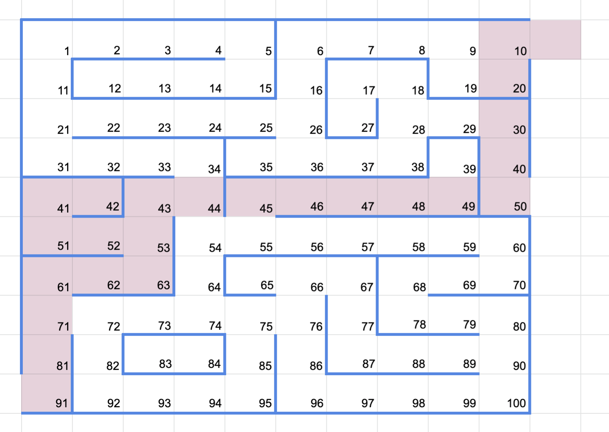
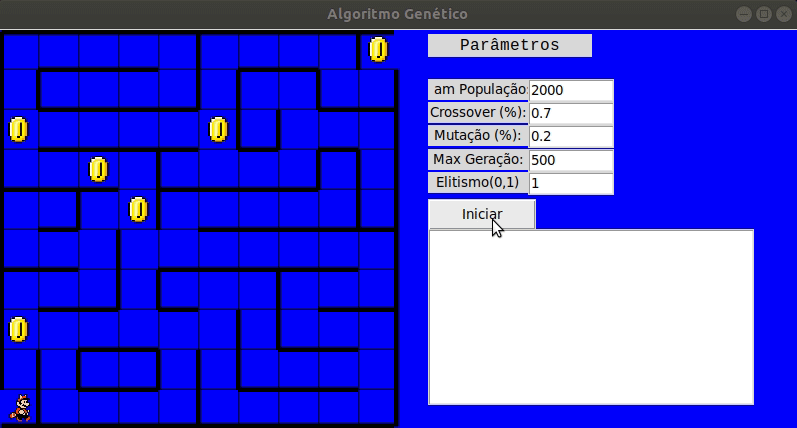

<h3>Apresentação</h3>
Trabalho de Inteligencia Artificial  

Neste trabalho desenvolvemos os conceitos de <strong>Algoritmo Genéticos</strong>,
tendo como objetivo, o agente encontrar o melhor caminho para sair do labirinto.  
O mapa é fixo com 100 posições, possui paredes onde o agente não deve pular posições separdas por elas, assim como deve respeitar as posições válidas do mapa.  

<h4>Penalizações</h4>
Utilizamos o conceito de <strong>Fitness</strong> para calcular a validade do melhor caminho gerada a cada geração do algoritmo, estabelecemos algumas regras. 
 

<strong>O agente perde pontos toda vez que:</strong>
1. Atravessar uma parede.
2. Transicionar a uma posição inválida.
3. Dar voltas no mapa (repetir posições na rota).
4. Definir a ultima posição da rota muito distante da ultima posição ideal.

<h4>Recompensas</h4>

Utilizamos o conceito de <strong>Cookies</strong> para ajustar a solução ótima, pois identificamos que apenas com as penalizações, o agente encontrava poucas vezes a solução ótima. 

<strong>O agente ganha pontos toda vez que:</strong>
1. Passa por posiçoes específicas.
2. Chega na posição final ótima (saída do labrinto).

<h3>Mapa</h3>

<h3>Simulação (interface) </h3>

